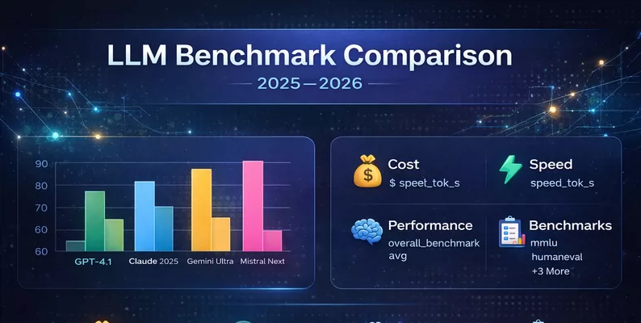
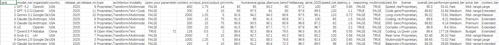

## Body

2025 - 2026 年 LLM 基准测试竞赛 | 24

Model comparison evaluation

A comprehensive comparison of 24 large language models (LLMs) released between 2024 and 2026 was conducted. Covering aspects such as performance benchmarks, pricing, speed, context window size, and functionalities. The aim is to assist researchers, developers, and data scientists in making informed decisions when selecting LLMs for specific use cases.

The models covered include those from companies such as OpenAI, Anthopic, Google DeepMind, Meta, DeepSeek, Alibaba, xAI, Mistral AI, IBM, Zhipu AI, and MiniMax.

Benchmark definition

Benchmark: The content measured
MMLU: General knowledge across 57 disciplines
HumanEval: Code generation—solving Python problems
GPQA Diamond: Doctoral-level reasoning ability in the scientific field
SWE-Bench; real-world software engineering tasks
HellaSwag: Commonsense reasoning ability
AIME 2025: Main findings of the advanced mathematics competition

## Images

Here is a pay link on Stripe ( https://buy.stripe.com/3cs8yP7sY87d0vu9AB ). Please contact me lonlonago@foxmail.com after funding $89, and I will send you a complete data files , thank you!

